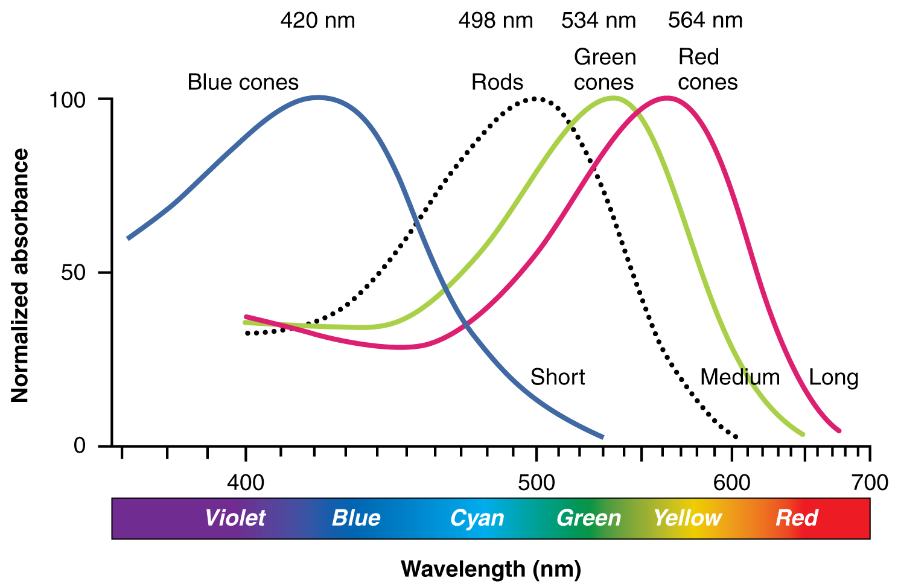

```{r setup, include=FALSE}
knitr::opts_chunk$set(echo = TRUE)
knitr::opts_chunk$set(fig.width=6, fig.height=4) 
library(tidyverse) #dplyr and ggplot
library(languageR) #for data

## I needed these options below to generate the plots for slides portion
## leave commented out for class purposes please!
#knitr::opts_chunk$set(cache = TRUE)
#library(cowplot) #plot panels for passing into knitr
#library(dichromat) #simulate colorblindness
#library(viridisLite) ## a viridis variant
```

# Why are some plots easier to read than others?

Vision doesn't come for free.  One whole lobe of our brains (occipital lobe, in the back) is dedicated primarily to processing what we see. 

Humans are good at:

- Seeing high-contrast adjacent differences & angles of lines

    - Why: Early parts of the visual stream are dedicated to contrast & orientation

- Finding one relevant detail at a time

    - Why: The eye only sees 5 degrees of visual angle at a time, & the brain fills in the rest
  
- Seeing contrast in light vs dark, and yellow vs green.

    - Why: Color vision is surprisingly complicated


# Pitfall 1: The role of visual attention

Your brain binds discrete visual properties together to show you a cohesive world.

Combinations of things -- relations -- take cognitive work.

 - Make plots as simple as possible to convey the required information.
 

Single features like color, orientation (A,B,D) lead to 'pop-out' unlike feature combinations (C,E,F)
 
 - Use single shapes, not relations between them (line plots > bar plots)

 


# Pitfall 2: Color is more complex than you think.

The visual system works via a set of sensors in your eye called _rods_ and _cones_

Rods are super sensitive to low levels of light -- they're known as your 'light / dark' detectors.  Light vs dark is easy!

There are 3 types of cones, differently sensitive to different wavelengths in the  spectrum of visible light. This means that each cone has to work _in combination_ with the others to see color. Color is harder!

{width=40%}

# Pitfall 2: Color is more complex than you think.

1. Rainbows are bad for everyone: Here is the same plot in two scales-- note how strong the perceptual difference is between 0.5 and 0.7 in the rainbow plot, but not viridis.

{width=60%}
<!-- commented out code for generating rainbow plot -->
<!-- ```{r rainbow, message=FALSE, warning=FALSE, fig.height=2} -->
<!-- # p <- ggplot(iris,aes(x=Sepal.Length,y=Sepal.Width,color=Petal.Width))+ -->
<!-- #   geom_point()+theme_bw() -->
<!-- #  -->
<!-- #  -->
<!-- # plot_grid( -->
<!-- # p + scale_color_gradientn(colors=rainbow(5)), -->
<!-- # p + scale_color_gradientn(colors=viridis(5)) -->
<!-- # ) -->
<!-- ``` -->

2. 4.5% of the population is colorblind. Left: the ggplot standard red-vs-green; Right: same plot with simulated deutan deficiency (most common form of colorblindness). Note how 'red' and 'green' look identical!

{width=60%}

<!-- commented out code for generating colorblind plot -->
<!-- ```{r colorblind, message=FALSE, warning=FALSE, fig.height=2} -->
<!-- #p2 <- ggplot(iris,aes(x=Sepal.Length,y=Sepal.Width,color=Species, shape=Species))+ -->
<!-- #  geom_point()+theme_bw() -->
<!-- # -->
<!-- #plot_grid( -->
<!-- #p2 + scale_color_manual(values=c("#F8766D","#00BA38","#619CFF")), -->
<!-- #p2 + scale_color_manual(values=dichromat(c("#F8766D","#00BA38","#619CFF"),type="deutan")) -->
<!-- #) -->
<!-- ``` -->


# Cognitively oriented data viz goals

Our goal is to make a plot that is as simple as possible but portrays the data *accurately*, avoiding pitfalls of relational reasoning and color vision.

* To learn more, do some reading on sensation / perception and attention! 

\

For our purposes today, let's talk more about how to emphasize different contrasts with different visualizations.

In the rest of the slides are some examples, with code for how to implement in ggplot2.  All data use the lexdec data set in languageR()

Work along with me by opening the dataVizIntro.Rmd file in R studio. Hit the 'run all chunks above' arrow (down arrow with green rectangle below) in line 127, and then run each chunk along with me as we go through the slides.

# Type 1: Correlation plots
These ask the question:

"How does Y change as a function of X"?

(Relationship between two or more linear variables)

# Scatterplot
X vs Y
```{r splot1, echo = TRUE}
ggplot(data=lexdec,aes(y=RT,x=Frequency,color=NativeLanguage)) +
  geom_point()
```

# Bubble plot
X vs Y and Z
```{r bplot, echo = TRUE}
p2<- ggplot(lexdec,aes(y=RT,x=Frequency,size=FamilySize))+
  geom_point(alpha=.1)

p2
```

# Bubble plot
X vs Y and Z
```{r bplot2, echo=TRUE}
## some prettying up...
p2 +  theme_classic()+
  ggtitle("Lexical decision RT by word frequency and morphological family size") +
  ylab("log RT") + xlab("Word Frequency (log)")
```


# Heatmap
Z as a function of X and Y
```{r heat, echo = TRUE}
#Do tabulations using dplyr:
corRT <- lexdec %>% group_by(Subject,Correct)%>% 
  summarise(meanRT=mean(RT))

ggplot(corRT,aes(Correct,Subject)) +
  geom_tile(aes(fill=meanRT)) +
  scale_fill_gradient(low="yellow",high="red")+
  ggtitle("Lexical decision RT for correct & incorrect trials by participant") 

```


# Type 2: Time series
Asks the question "how does Y change over units of time X?"

Uses connected lines, sometimes also points underneath

A special case of the correlation plot

# Time series
Y over time X
```{r timeseries, echo=T}
ggplot(lexdec,aes(y=RT,x=Frequency,shape=Correct)) +
  geom_point(alpha=.5)+
  geom_smooth(method='lm')+
  facet_grid(~NativeLanguage)+
  ggtitle("Lexical decision RT for correct & incorrect trials by participant native language") 
  
```


# Type 3: Part-whole and distribution plots
Asks the question: "How does some categorical X affect (the distribution of values of) Y"

This is a really common scientific question.

The answer to this question has often been portrayed as a bar plot in the literature ('how does X affect Y')-- but a distribution is a lot nicer, and something that is more and more common.

# Bar plots
Mean of Y over categorical X.

This plot isn't inaccurate (google 'BarBarplots' for more...sometimes bar plots are actually *inaccurate* visualizations), but it's also not that useful.

```{r barbar, echo=T}
ggplot(lexdec, aes(y=RT,x=Complex))+
  stat_summary(fun.y=mean,geom="bar")+
  facet_grid(~NativeLanguage)

```  

# Violin
Distribution of Y over X-- emphasizes change in distribution shape.
```{r violin, echo=T}
ggplot(lexdec,aes(y=RT,x=Complex)) +
  geom_violin(draw_quantiles=c(.25,.5,.75)) 
```

# Box plot
Distribution of Y over X-- emphasizes mean & interquartile interval.
```{r box, echo=T}

ggplot(lexdec,aes(y=RT,x=Complex)) +
  geom_boxplot()
```

# Density plot
Distribution of Y over X-- continuously-varying.
```{r density, echo=T}
ggplot(lexdec,aes(x=RT,fill=Complex))+ ## fill is the color command for shapes like density plots, violins, etc.
  geom_density(alpha=.5)+
  scale_fill_viridis_d()  ## this viridis palette comes from latest ggplot2

```

# Histogram
Distribution of Y over X-- counts
```{r hist, echo=T}
ggplot(lexdec,aes(x=RT,fill=Complex))+
  geom_histogram(bins=20,color="black") +  ## note how color here changes the lines around the histogram
  facet_grid(.~Complex)  ## default is to overlay, so let's add a panel

```

# ...That's it!

With these simple bits of code, you can visualize almost anything you desire, in a way that is cognitively sensible! With ggplot2, you can combine lots of different aesthetics together to customize.  

To learn more about what the tools are: https://ggplot2.tidyverse.org/reference/index.html

And to learn more about ways to combine them: https://www.r-graph-gallery.com/
